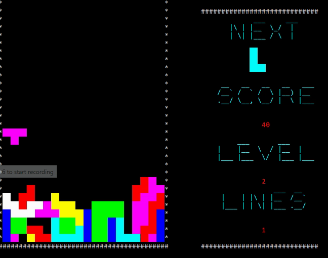
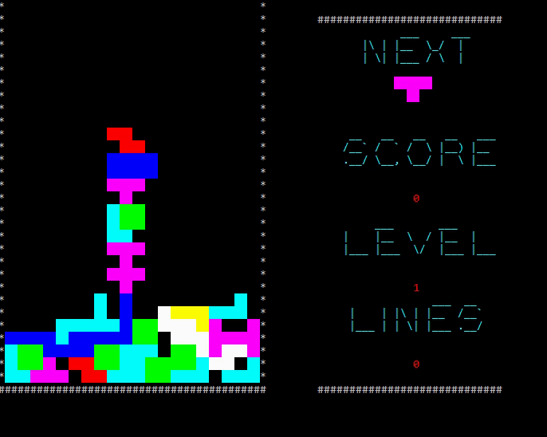
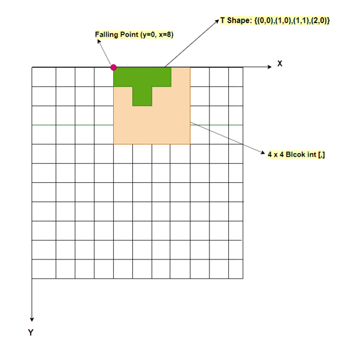
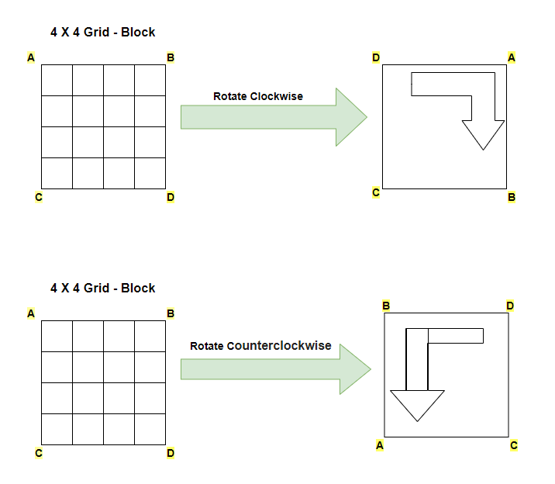

# CSharp: Tetris_Game 

## Game Rules
Tetris is a one-person game where random pieces of blocks fall, in an empty rectangular game board. The player is allowed to rotate and horizontally move the falling piece.
If the entire row of the board is filled with blocks, it is removed. The main purpose of the game is to keep on playing as long as possible.
You have to make full horizontal lines with the different shaped blocks that fall into the game area. Full lines will then disappear and provide points. The more lines you make at the same time, the more points you earn.

## Basic Features
* Award points by dropping (soft and hard dropping). Giving points based on the number of lines are cleared.
* Display the next piece to enter the field.
* Able to rotate the block clockwise or counterclockwise.
* Score Board: Next Piece, Total Score, Level and Total Removed Lines.
* Remove each line = 40 points.
* The dropping speed will increase when the level goes up.
* Store the highest score.
* Able to pause the game

## When blocks hit the top of the board -- GAME OVER

## Classes
* Program.cs: Main() method.
* Board.cs (20 x 30 grid board): place block, drop block, check remove, fill cell & clear row.
* Piece.cs: define 7 Bricks { I, O, T, S, Z, J, L } and store the coordinates of each Block .
* Display.cs: render the game board, score board and game over screen.
* Point.cs (struct): hold the X & Y value.
* Cell.cs (struct): Cell’s properties: Val (0 or 1) & Color.

# Place a Block

# Rotate a Block

